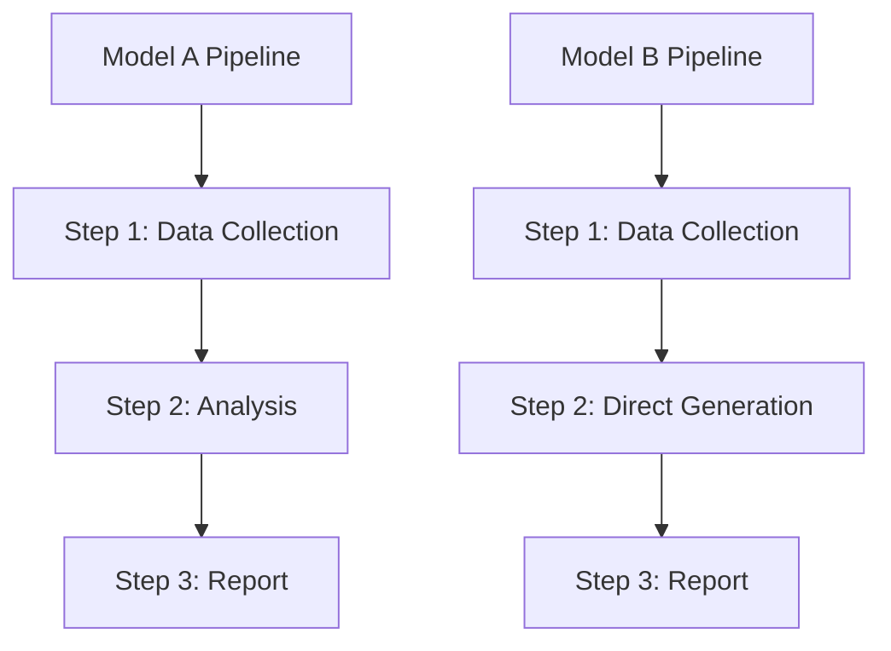

# Generating Comparison Reports

Produce professional comparative analysis reports from multiple data sources with diverse visualizations.

## When to Use

**Activate when:**
- Comparing multiple models, skills, tools, or solutions
- Generating benchmark/evaluation reports across entities
- Cross-referencing data from multiple directories or sources
- User mentions "对比分析", "横向评测", "综合报告", "模型横评", "技术选型", "Skill对比"

**Do NOT activate when:**
- Single-entity analysis (no comparison needed)
- Simple data extraction without reporting
- User only wants a summary, not a full report

## Prerequisites

1. Target output directory must exist — create if missing
2. Windows: writing outside project requires `New-Item -ItemType Directory` first, then `Copy-Item`

**Artifact versioning**: At workflow start, generate a `run_ts` timestamp (`YYYYMMDD_HHMMSS`) and use it as the version identifier on ALL intermediate files (JSON, logs, validation reports). This creates an immutable, traceable artifact chain.

**Output separation**: Final deliverables (`.html`, `.md`) go in `{output_dir}/` root. ALL intermediate artifacts (JSON data files, validation reports, logs) go in `{output_dir}/tmp/`. Create `tmp/` subdirectory at workflow start.

```
{output_dir}/
├── 对比分析报告.html       ← final deliverables only
├── 对比分析报告.md         ← final deliverables only
└── tmp/                    ← ALL intermediate artifacts
    ├── collected_data_{run_ts}.json
    ├── analysis_{run_ts}.json
    ├── validation_html_{run_ts}.json
    └── run_{run_ts}.log
```

## Workflow

```
Task Progress:
- [ ] Step 0: Initialize (generate run_ts, create output dir + tmp/)
- [ ] Step 1: Data Collection
- [ ] Step 2: Deep Exploration
- [ ] Step 3: Analysis & Cross-validation
- [ ] Step 4: Generate HTML Report
- [ ] Step 5: Generate Markdown Report
- [ ] Step 6: Validate & Deliver
```

### Step 1: Data Collection

1. List all source directories recursively
2. Read all top-level report files in parallel (.md / .json / .txt)
3. Read configuration/definition files (SKILL.md etc.)
4. Extract: entity names, step counts, script counts, core approach

**Retry ceiling**: Maximum **5 retries** per read operation (file read, JSON parse, API call). After 5 failures, mark the data source as "data unavailable — retry exhausted", annotate with `⚠️`, and continue with available data. Never loop infinitely.

**Entity Name Standardization**: Unify to full names at collection time (e.g., `DeepSeek-V4-Pro`, never `v4-pro`). Use consistently throughout.

### Step 2: Deep Exploration

1. Enter subdirectories (agent-1/agent-2/... or tmp/), read detailed artifacts
2. Read intermediate files (viewpoints.json / data_summary.json etc.) for quality analysis
3. Extract per-entity/per-module details (time / tokens / size / result / errors)

### Step 3: Analysis & Cross-validation

Extract dimensions (adjust per report topic):

| Category | Metrics | Method |
|:---------|:--------|:-------|
| Efficiency | Avg time, min/max, speedup ratio | From evaluation reports |
| Cost | Token usage, unit price, total cost | Token count × pricing |
| Stability | First-run success rate, final success rate, interruption rate | Success/fail counts |
| Quality | Score range, chart completion, placeholder residuals | Score + artifact analysis |
| Compliance | Violation count, type, content | Pattern matching + annotation |

**Cross-validation**:
- Cross-check key numbers across sources (e.g., viewpoints.json vs data_summary.json)
- Flag contradictions with `⚠️` and explain both calculation methods
- Clearly distinguish **infrastructure failures** (MCP timeouts, SSE connection errors, script bugs) from **entity quality failures** (incorrect output, format errors, content violations)

**Handling partial failures**:
- When some Agents/runs fail due to infrastructure issues, compute and report **"success subset" statistics** (avg time / size / quality from successful runs only) alongside overall stats
- Annotate infrastructure-affected entities with `*` footnote and separate explanatory note
- Never conflate infrastructure failures with entity quality in scoring — if infra-affected, note it and optionally recommend re-evaluation

**Key finding patterns to detect**:
- "No difference" is a finding — when entities score identically on certain dimensions (e.g., all 13/16 pass), this IS a meaningful result worth highlighting
- "Infrastructure ≠ quality" — when failures are clearly environmental, separate them from model quality in analysis

### Step 4: Generate HTML Report

**Page structure** (top to bottom): Title + metadata → Errata/correction notice (if applicable) → KPI cards (4-5 gradient cards) → TOC navigation → Executive summary → Chapter sections with dividers → Optimization suggestions → Conclusion & recommendations → Appendix.

**Errata/correction section** (use when a v2.0 or corrected edition):
```css
.errata-box { background: #FFF0F0; border-left: 4px solid #C41230; padding: 16px 20px; margin: 16px 0; border-radius: 0 8px 8px 0; }
```
Include a numbered list of corrections with explicit before→after changes.

**Section numbering**: Sub-sections must match parent chapter number (e.g., under "十、Architecture" use 10.1/10.2, never 9.1/9.2). Verify before generating.

**TOC navigation**: Grouped layout with color-coded categories (Overview/Data/Scoring/Conclusion), CSS Grid dual-column, font hierarchy 16→15→13→12px. See [delivery-standard.md](references/delivery-standard.md) for full CSS.

**Chart type selection** — the skill now includes an auto-recommendation engine. Before manually picking charts, apply the pseudocode algorithm at the top of [chart-selector.md](references/chart-selector.md#auto-recommendation-engine) to auto-detect which chart types best fit the analyzed data. Only override if the user explicitly requests a specific chart.

| Data characteristic | Chart type |
|:--------------------|:-----------|
| Multi-entity ranking | Horizontal bar |
| A/B binary comparison | Butterfly (bidirectional bar) |
| Composition breakdown | Donut (pie with radius) |
| Multi-dimensional (3-6) | Radar |
| Two-variable correlation | Scatter + markLine quadrants |
| Flow/path divergence | Sankey |
| Percentage comparison | Grouped horizontal bar |
| Near-identical values | Table inline progress bar |
| Time-series trend over periods | Line |
| Dense matrix (many × many) | Heatmap |
| Distribution (multiple samples) | Boxplot |
| Hierarchical proportion | Treemap |
| Stage attrition / conversion | Funnel |
| 7+ dimensions (replace radar) | Parallel |
| Multiple samples per entity (ECharts 6.0) | Beeswarm |
| Large value gaps between entities (ECharts 6.0) | Broken axis bar |
| Cross-entity relationship (ECharts 6.0) | Chord |

> ❌ Never use only vertical bar charts. Cover ≥3 chart types per report.
> 📐 ECharts 6.0 charts must include v5 fallback (see version gating below).

**Chart container height variants** — choose based on data density:
```css
.chart-box { height: 420px; }        /* default: scatter, bar, donut */
.chart-box-sm { height: 350px; }      /* compact: simple ranking / pie */
.chart-box-radar { height: 480px; }   /* tall: radar with legend */
.chart-row { display: grid; grid-template-columns: 1fr 1fr; gap: 20px; }  /* side-by-side charts */
.chart-row .chart-half { height: 380px; }
```

**Color system**: Green `#00875A` (best) / Blue `#0066B3` (normal) / Orange `#E6A23C` (warning) / Red `#C41230` (bad). See [delivery-standard.md](references/delivery-standard.md) for full CSS.

**Responsive & Dark Mode (REQUIRED)**: Every report `<style>` block MUST include the responsive breakpoints and dark mode CSS from [delivery-standard.md](references/delivery-standard.md#responsive--dark-mode-required-in-every-report-style). Also include the dark mode toggle button HTML and JS. Do not skip these — reports must render correctly on mobile devices and in dark mode via the manual toggle.

### ECharts Setup & Pitfalls

**CDN pre-check (Step 4 gate)**: Before generating HTML, verify `staticfile.net` is reachable. If unreachable, generate the report anyway but insert a prominent warning banner at the top noting "图表可能需要网络连接才能加载".

**Retry ceiling for Steps 2-6**: Maximum **3 retries** for any step-level failure. After 3 failures, mark the affected section with `⚠️ [数据不可用]` and continue. For HTML generation failures: simplify chart configs (remove the failing chart type, replace with a simpler type like horizontal bar) on retry.

**CDN (REQUIRED)** — use `staticfile.net`, do NOT use bootcdn / jsdelivr / npmmirror:

```html
<script src="https://cdn.staticfile.net/echarts/5.5.0/echarts.min.js"></script>
```

Do NOT add fallback CDN scripts or `if (typeof echarts === 'undefined')` checks — they cause silent failures.

**Chart initialization (REQUIRED)** — use a global `initChart()` helper with a single debounced resize handler. Never use IIFE wrappers:

```javascript
var _charts = [];
function initChart(id, option) {
  var dom = document.getElementById(id);
  if (!dom) return;
  var chart = echarts.init(dom);
  chart.setOption(option);
  _charts.push(chart);
  return chart;
}
var _resizeTimer;
window.addEventListener('resize', function() {
  clearTimeout(_resizeTimer);
  _resizeTimer = setTimeout(function() { _charts.forEach(function(c) { c.resize(); }); }, 100);
});
// Linked cross-chart highlighting
echarts.connect('report-group');
```

**Pitfall list — MUST avoid these 5 mistakes:**

| # | ❌ Wrong | ✅ Correct |
|:--|:--------|:----------|
| 1 | `markLine` at **top level** of option → `{ series: [...], markLine: {...} }` | `markLine` **inside** `series[0]` → `{ series: [{ type:'scatter', markLine: {...} }] }` |
| 2 | Butterfly: **dual-grid** (`grid: [{...}, {...}]`) with `gridIndex` | Butterfly: **single grid** + `xAxis[0] { inverse: true }` + `xAxis[1] { gridIndex: 0 }` |
| 3 | Sankey: all nodes same color, `nodeAlign: 'left'`, opaque links | Sankey: **gradient colors** (dark→light per pipeline), `nodeAlign: 'justify'`, `lineStyle.opacity: 0.25` |
| 4 | Chart `<script>` wrapped in `(function() { ... })()` IIFE | Flat `initChart()` calls, no nesting |
| 5 | Legend colors don't match bar colors (ECharts auto-assigns) | Set top-level `color: ['#hex1', '#hex2']` matching series order |

### Accessibility (REQUIRED — WCAG 2.1 AA compliance)

Every chart option MUST include `aria` config. This is a one-line addition per chart that enables screen-reader support and colorblind-safe decal patterns:

```javascript
// Add this to every chart option object
aria: { show: true, decal: { show: true } }
```

**What this does**:
- Auto-generates `aria-label` on each chart `<canvas>`, readable by screen readers
- Applies hatch/pattern fills (bubble/circle/rect/roundRect/triangle/diamond/pin/arrow) to bars/sectors so colorblind users can distinguish data series without relying on color alone
- `AriaComponent` is included in the CDN full build (`echarts.min.js`) — no additional import needed
- Zero performance impact, zero risk: if ECharts version doesn't support it, the key is silently ignored

### Chart Export Buttons

Add a PNG download button to every chart container. The button downloads a high-resolution PNG of the current chart:

```html
<div class="chart-wrap">
  <div id="chart-1" class="chart-box"></div>
  <button class="chart-export-btn" onclick="exportChart('chart-1', 'chart-name')" title="下载 PNG">⬇</button>
</div>
```

```javascript
function exportChart(chartId, filename) {
  var c = _charts.find(function(ch) { return ch.getDom().id === chartId; });
  if (!c) return;
  var url = c.getDataURL({ type: 'png', pixelRatio: 2, backgroundColor: '#fff' });
  var a = document.createElement('a');
  a.href = url; a.download = filename + '.png'; a.click();
}
```

CSS for the export button:

```css
.chart-wrap { position: relative; }
.chart-export-btn { position: absolute; top: 8px; right: 8px; width: 32px; height: 32px; border: 1px solid #D4E4F7; border-radius: 6px; background: rgba(255,255,255,0.9); cursor: pointer; font-size: 14px; opacity: 0; transition: opacity 0.2s; z-index: 10; }
.chart-wrap:hover .chart-export-btn { opacity: 1; }
.chart-export-btn:hover { background: #F0F7FF; border-color: #0066B3; }
```

**Rule**: Every chart container MUST be wrapped in `.chart-wrap` (replaces bare `.chart-box` wrapper). Export button appears on hover, unobtrusive.

### Linked Cross-Chart Highlighting

All charts in a report share a connected group. When hovering an entity in one chart, the same entity highlights simultaneously in all other charts:

```javascript
// Each chart option adds:
group: 'report-group',

// Connected via initChart helper (done once at top of <script>):
echarts.connect('report-group');
```

**Rule**: Every chart option MUST include `group: 'report-group'`. This has zero effect on rendering — it only activates when the user hovers. No performance penalty.

**Color consistency across linked charts**: When the same entity appears in multiple chart types (bar, radar, scatter), use the same color. Define a global color map:

```javascript
var ENTITY_COLORS = { 'Model A': '#00875A', 'Model B': '#0066B3', 'Model C': '#E6A23C' };
```

Reference `ENTITY_COLORS[name]` (or `ENTITY_COLORS[p.name]` in formatter callbacks) instead of ad-hoc per-chart colors. This ensures that when linked highlighting triggers, entity colors are identical across bar/radar/scatter/line.

### Lazy Chart Rendering

For reports with **8+ charts**, defer non-visible chart initialization until the user scrolls to them. This prevents the initial blank-screen lag when many ECharts instances load simultaneously:

```javascript
var _rendered = {};

function initChartLazy(id, option, immediate) {
  var dom = document.getElementById(id);
  if (!dom) return;
  if (immediate) { return initChart(id, option); }

  var observer = new IntersectionObserver(function(entries) {
    entries.forEach(function(e) {
      if (e.isIntersecting && !_rendered[id]) {
        _rendered[id] = true;
        initChart(id, option);
        observer.unobserve(e.target);
      }
    });
  });

  observer.observe(dom);

  // Safety net: force-render after 4 seconds even if IntersectionObserver fails
  setTimeout(function() {
    if (!_rendered[id]) { _rendered[id] = true; initChart(id, option); observer.unobserve(dom); }
  }, 4000);
}
```

**Rules**:
- First 2 visible charts (KPI area + first section chart) use `initChart()` (immediate)
- All remaining charts use `initChartLazy(id, option)` (deferred)
- The 4-second safety net ensures charts render even if `IntersectionObserver` is unavailable or misbehaves

### Progressive Rendering (Large Datasets)

When a line/scatter chart has **>500 data points**, add `progressive` to avoid rendering lag:

```javascript
series: [{ type: 'line', progressive: 200, data: [...] }]
```

This renders data points in batches of 200 per animation frame. Only apply when data point count exceeds 500 — for smaller datasets it has no effect.

### ECharts 6.0 Version-Gated Features

The skill supports ECharts 6.0+ features via a version gate. When the CDN upgrades, charts automatically adopt v6 features; otherwise they fall back to stable v5 configs:

```javascript
var E6 = (typeof echarts !== 'undefined' && echarts.version && String(echarts.version).startsWith('6'));
```

**New chart types (v6 only, fallback otherwise)**:

| v6 chart | Data signal | Fallback if v5 |
|:---------|:------------|:---------------|
| **Beeswarm** | Multiple data points per entity (e.g., per-Agent-run times) | Boxplot |
| **Broken axis** | Large value gaps between entities (e.g., 2s vs 180s) | Standard bar with annotation |
| **Chord** | Cross-entity relationship/flow (e.g., shared output patterns) | Heatmap |

When using v6 charts, always provide a v5 fallback:

```javascript
if (E6) {
  initChart('chart-1', beeswarm6Option);
} else {
  initChart('chart-1', boxplotOption);  // v5 fallback
}
```

v6 also supports **automatic dark mode** via `prefers-color-scheme`. When available, sync with the report's existing dark mode toggle by calling `chart.dispose()` + re-init with the theme-aware option on toggle.

### Report Version Diff (v3.0+)

When a previous run's analysis JSON exists in `tmp/`, auto-generate ▲/▼ trend indicators comparing the current run against the previous:

1. At Step 3 data collection, scan `tmp/` for the most recent `analysis_*.json` (excluding current `run_ts`)
2. For each numeric metric, compute delta: `(current - previous) / previous * 100`
3. In HTML tables, annotate changed values: `<span class="diff-up">▲ +15%</span>` / `<span class="diff-down">▼ -8%</span>`
4. In the Executive Summary, add a "Notable Changes" section with the top 3 largest absolute deltas

```css
.diff-up { color: #C41230; font-size: 11px; font-weight: 600; margin-left: 4px; }
.diff-down { color: #00875A; font-size: 11px; font-weight: 600; margin-left: 4px; }
```

**When no previous run exists**: silently skip diff annotations — don't mention diffing in the report.

**Sankey color gradient pattern** — dark → light progression within each pipeline:
```
V1 (old/legacy): #B71C1C → #C62828 → #D32F2F → ... → #FF7043 → #C41230 (final)
V3 (new/lean):  #1B5E20 → #2E7D32 → #388E3C → ... → #4CAF50 → #00875A (final)
```

**Butterfly canonical template:**
```javascript
{
  color: ['#C41230', '#00875A'],  // ensures legend/bar match
  grid: { left: 80, right: 80, bottom: 30, top: 60 },
  xAxis: [
    { type: 'value', inverse: true, name: 'Left label', axisLabel: { formatter: '{value}分' } },
    { type: 'value', name: 'Right label', gridIndex: 0, axisLabel: { formatter: '{value}分' } }
  ],
  yAxis: { type: 'category', data: [...] },
  series: [
    { name: 'Left entity', type: 'bar', xAxisIndex: 0, data: [...], label: { position: 'left' } },
    { name: 'Right entity', type: 'bar', xAxisIndex: 1, data: [...], label: { position: 'right' } }
  ]
}
```

> ⚠️ Butterfly left/right must use the **same unit** — convert if data sources differ (e.g., seconds → minutes).

**Validation checklist** — after generating HTML, open in browser and verify:
1. Browser console has **zero errors** (F12 → Console)
2. All chart canvases render (no blank areas, no error text)
3. Legend colors match bar/line colors
4. Chart labels are readable (no truncation/overlap)
5. Hovering an entity highlights it in ALL charts simultaneously (connected group test)
6. Hovering chart containers reveals export button; clicking downloads PNG
7. Run Lighthouse audit: accessibility score ≥ 90

**KPI cards**: Use 4 or 5 cards (N = number of key headline metrics). Each card has `.kpi-value` (large number), `.kpi-label` (description), and `.kpi-sub` (detail). Cards get color classes: `.kpi-green`, `.kpi-blue`, `.kpi-red`, `.kpi-gold`.

**Table row color coding** — mark exceptional rows:
```css
.bad-row td { background: #FFF0F0; }    /* severe failures / worst performers */
.mid-row td { background: #FFFBE6; }     /* marginal / requires attention */
.good-row td { background: #F0FFF4; }    /* exceptional / best performers */
```
Apply `class="bad-row"` or `class="mid-row"` on `<tr>` elements for visual signaling.

**Score cards in conclusion** — display ranked entities as medal cards:
```css
display: grid; grid-template-columns: 1fr 1fr 1fr 1fr 1fr; gap: 12px;
/* Each card: background + border + bold score + entity name + one-line tag */
```

**Appendix** — must include:
1. Data source enumeration (file paths or patterns used)
2. Validation methodology (which check files, what they check)
3. Runtime environment (OS, shell, Python version, model provider)
4. Any known data gaps or caveats

### Step 5: Generate Markdown Report

**Structure**: Title table → Key metrics summary → TOC with anchors → Executive summary → Dimension chapters (each with `> 📊 HTML chart type: XX`) → Optimization suggestions → Architecture differences → Conclusion → Appendix.

**Format rules** — see [delivery-standard.md](references/delivery-standard.md):
- Tables: descriptive cols left-aligned, numeric cols centered
- Units: standardize across entire report (min / pp / KB / 万 Tokens)
- Color-coded ratings: 🟢 excellent 🟡 medium 🟠 warning 🔴 poor
- Key values: **bold**
- Footnotes: `*` `†` `††` below tables for calculation method differences
- Infrastructure-affected entities: annotate with `*` and explain in table footnote
- When data is incomplete: report "success subset" stats alongside overall, with clear annotation

**Architecture / pipeline diagrams in MD**: Use Mermaid syntax instead of ASCII art. Mermaid renders natively in GitHub, GitLab, and VSCode:

````markdown

````

**Collapsible sections**: Wrap long tables in `<details>` to keep MD reports scannable:

```markdown
<details><summary>详细验证结果（展开查看）</summary>

| 检查项 | 结果 |
|:-------|:-----|
| ... | ... |

</details>
```

### Step 6: Validate & Deliver

1. **Validate HTML**: open in browser, verify all charts render (check ECharts container IDs match `initChart()` calls)
2. **Validate Markdown**: verify all anchors resolve, Mermaid syntax correct
3. **Cross-check**: key numbers identical between HTML and Markdown versions
4. **Correction audit**: if this is a corrected edition, verify each errata item against source data
5. **Clean output**: ensure only final `.html` + `.md` deliverables in `{output_dir}/` root, all intermediates in `{output_dir}/tmp/`
6. Copy both files to target directory (`Copy-Item -Force` on Windows)
7. Verify output files are non-zero size

If validation fails, fix issues and re-validate before proceeding. Never deliver without passing all 7 checks.

## Examples

**Input**: "对比 D:\model-a 和 D:\model-b 的评测报告，生成综合对比分析，保存到 D:\output"
**Output**: 
```
D:\output\对比分析报告.html
D:\output\对比分析报告.md
D:\output\tmp\collected_data_20260513_143025.json
D:\output\tmp\analysis_20260513_143025.json
```

**Input**: "横向评测这 5 个模型的效果，用图表展示差异"
**Output**: HTML with radar chart (5-model capability comparison), scatter plot (time vs quality), horizontal bar chart (cost ranking)

**Input (English)**: "Compare the two benchmark runs in D:\run-v1 and D:\run-v2, generate a comprehensive comparison report with charts"
**Output**: 
```
D:\output\comparison-report.html
D:\output\comparison-report.md
D:\output\tmp\collected_data_20260522_143000.json
```

## References

- [Delivery Standard](references/delivery-standard.md) — format, data, visualization, structure rules, responsive/dark mode CSS
- [Chart Selector](references/chart-selector.md) — auto-recommendation engine + ECharts config templates
- [manifest.yaml](manifest.yaml) — cross-platform metadata (Codex, OpenClaw, Claude Code)
- [agents/openai.yaml](agents/openai.yaml) — OpenAI-platform skill metadata
